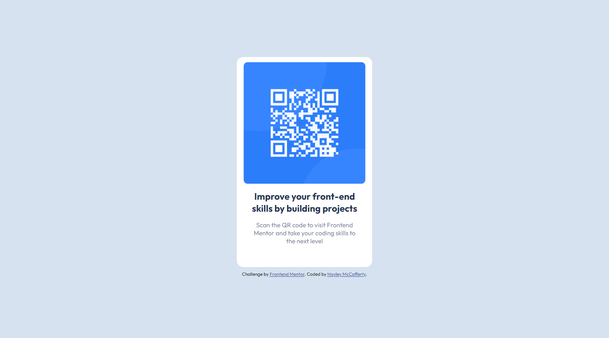
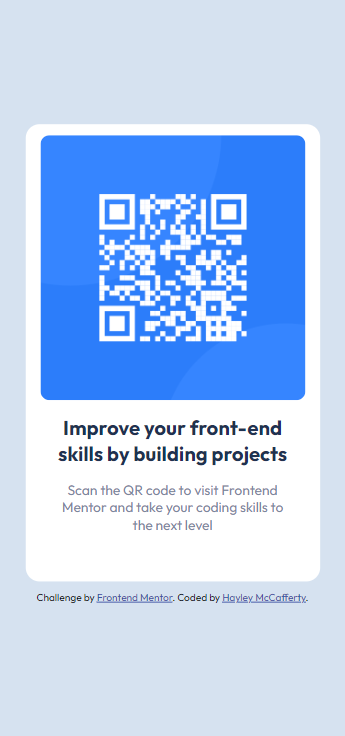

# QR Code Component

Challenge from [Frontend Mentor](https://www.frontendmentor.io/)

## Usage

The purpose of this project was to practice HTML and CSS skills with a design
from Frontend Mentor challenge

## Challenge Description

"A perfect first challenge if you're new to HTML and CSS. The card layout
doesn't shift, so it's ideal if you haven't learned about building responsive
layouts yet."

## Tech Stack

**Client:** HTML, CSS

## Authors

- [@haylzrandom - Frontend Mentor](https://www.frontendmentor.io/profile/HaylzRandom)
- [@HaylzRandom - GitHub](https://github.com/HaylzRandom)

## Acknowledgements

- [QR Code Component](https://www.frontendmentor.io/challenges/qr-code-component-iux_sIO_H)

## Related

Here are some related projects

- [NFT Preview Card Component](https://github.com/HaylzRandom/nft-preview-card-component)
- [Product Preview Card Component](https://github.com/HaylzRandom/product-preview-card-component)
- [Order Summary Component](https://github.com/HaylzRandom/order-summary-component)
- [Stats Preview Component](https://github.com/HaylzRandom/stats-preview-card-component)

## Screenshots

Desktop

Mobile

